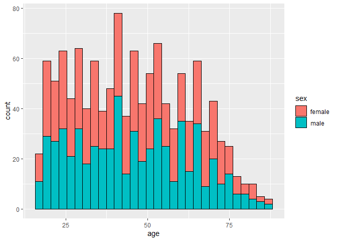
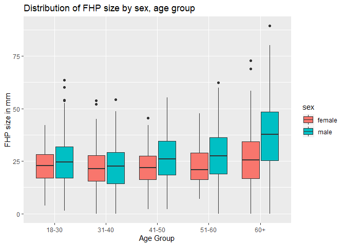
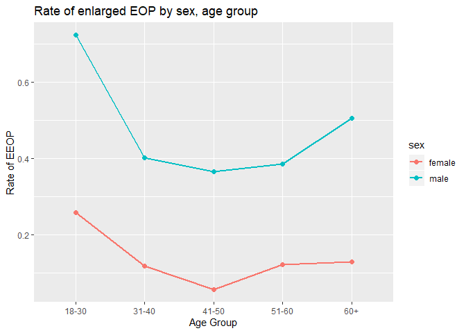
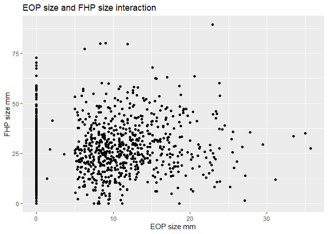
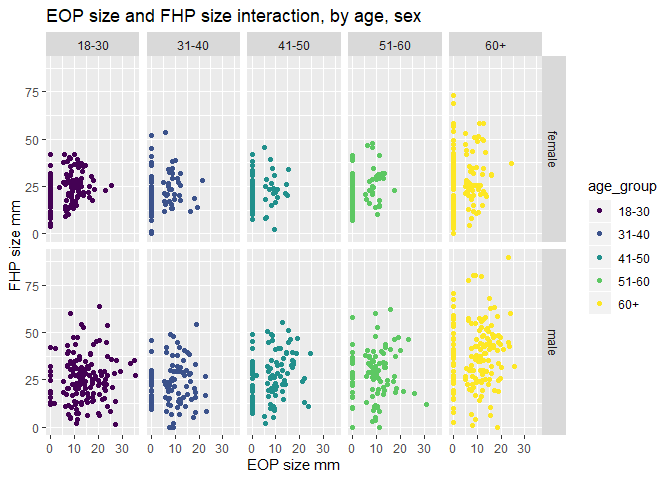
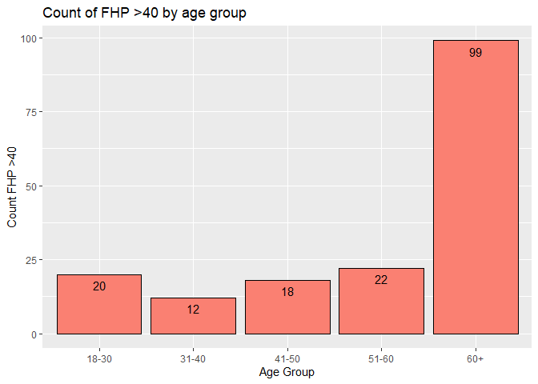

Code sample
================

The following project is an exploratory analysis examining trends in the
prevalence of EEOP, Enlarged External Occipital Protuberance or bony
projections, in young people.

### Data Summary

There are 1219 participants and 9 variables in the dataset. Significant
variables include: `eom_size_mm`, which indicates the size of the
protrusion, and `fhp_size_mm`, which indicates the extent of the
participants’ forward head protraction, a measure that is potentially
linked to EOP. The largest proportions of participants are between 18-30
and over 60. Sex is fairly evenly distributed.

| age\_group | female | male |
| :--------- | -----: | ---: |
| 18-30      |    151 |  152 |
| 31-40      |    102 |  102 |
| 41-50      |    106 |  101 |
| 51-60      |     99 |  101 |
| 60+        |    155 |  150 |

<!-- -->

EEOP is defined as an EOP larger than 10mm. We can assess the prevalence
of enlarged EOPs in the data by filtering `eop_size_mm` for EOPs larger
than 10mm, finding an EEOP rate of 32.16% in the sample.

| eeop\_rate |
| ---------: |
|  0.3215751 |

In data cleaning, irregularities were found in categorical variables
`eop_size_mm` and `fhp_category` where data does not adhere to the
defined categories. There are missing data in `eop_size_mm`,
`eop_shape`, and `fhp_size_mm`.

### Trends in age and sex

Our analysis found that men consistently had higher FHP measurements
than women, and that size of FHP increases with age. For reference, the
mean female FHP size was 23.71mm with a standard deviation of 10.62mm.
While the mean male FHP size was 28.49mm, with a standard deviation of
14.67mm.

<!-- -->

People 18-30 appear to have higher rates of EEOP and men showed higher
rates of EEOP than women across age groups.

<!-- -->

Our analysis examining at the relationship between EOP and FHP also
confirms that EOP size is higher among those 18-30, and that FHP is
highest for those over
60.

<!-- --><!-- -->

Based on the frequency, FHP greater than 40mm appears to be more
prevalent in those over 60.

<!-- -->

In summary our analysis finds that there is a higher rate of EEOP in the
18-30 group and a higher rate of FHP in those over 60.
